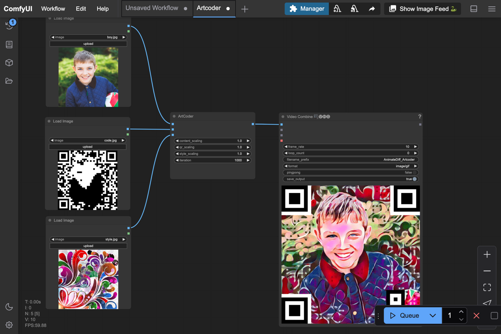

# ComfyUI_Artcoder
This project is a custom node for ComfyUI that uses [ArtCoder](https://arxiv.org/abs/2011.07815) [CVPR 2021] to refine videos generated by [AnimateDiff](https://arxiv.org/abs/2307.04725) [ICLR2024 Spotlight] or the other video. The node is to transform these videos into functional QR code videos that can be scanned.

## Some demo workflow
<b>Artcoder</b> 
[Artcoder.json](workflow/Artcoder.json)


## Artcoder Params
content_images: Images generate by AnimateDiff<br>
qr_image: QR code image<br>
style_image: Style image<br>
content_scaling: scaling for content<br>
qr_scaling: scaling for scanablity<br>
style_scaling: scaling for style<br>
iteration: ArtCoder refinement iterations
## Citation
Reference for unofficial ArtCoder implement
```bibtex
@misc{liao2024artcoder,
    title  = {A PyTorch implementation of ArtCoder},
    author = {Jia-Wei Liao},
    url    = {https://github.com/jwliao1209/ArtCoder},
    year   = {2024}
}
```
Reference for the original paper <b>Artcoder: an end-to-end method for generating scanning-robust stylized qr codes</b>
```bibtex
@inproceedings{su2021artcoder,
  title     = {Artcoder: an end-to-end method for generating scanning-robust stylized qr codes},
  author    = {Hao Su, Jianwei Niu, Xuefeng Liu, Qingfeng Li, Ji Wan, Mingliang Xu, Tao Ren},
  booktitle = {CVPR},
  year      = {2021}
}
```
